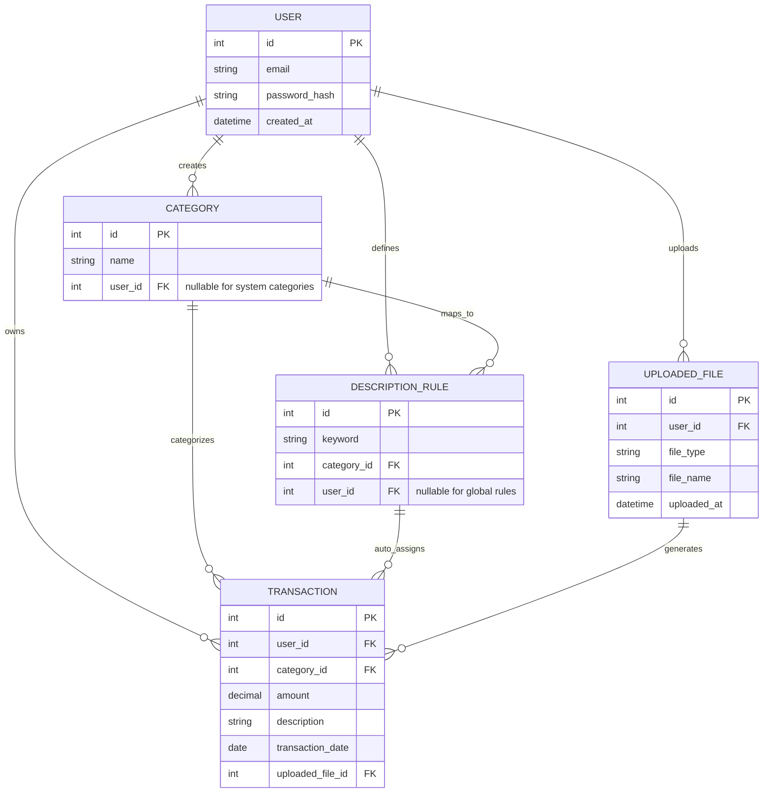

# PersonalFinanceAnalyzer
A web application that allows users to upload bank transactions and automatically categorize spending, visualize trends, and generate budgeting

# Logical Data Design

## Notes

* **Categories** can be either system-defined (user_id = null) or user-defined
* **Description rules** map keywords (e.g., "Walmart", "Uber") to categories
* When a transaction is processed:

  * The system checks description rules
  * If a match is found → category is auto-assigned
  * If no match → fallback to a default category (e.g., "Uncategorized")
* Users can override categories, and optionally create new rules from their changes
